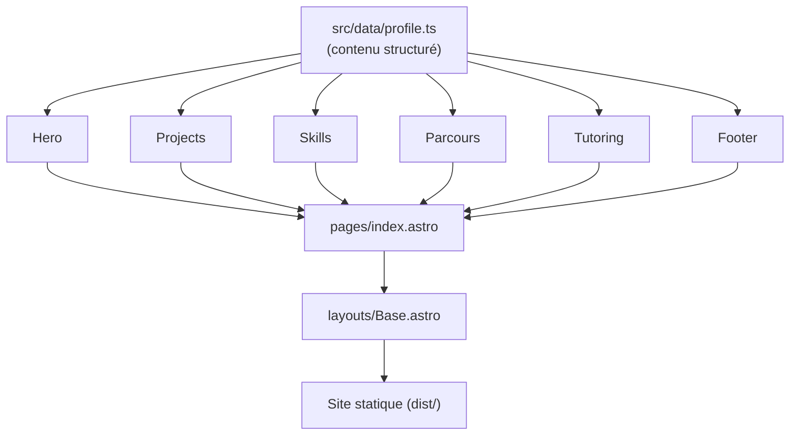
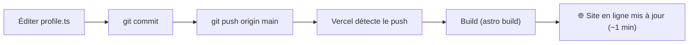

# Méthodologie & Workflow

Ce document explique **comment ce projet a été pensé et construit**, et **comment travailler au quotidien** dessus. Il sert de référence pour comprendre les choix techniques et le cycle de développement.

---

## 1. Vue d'ensemble

L'objectif est de bâtir la **présence web professionnelle de Landry Kubwimana**, découpée en **deux sites distincts** :

| Site | Rôle | Nature | Statut |
|------|------|--------|--------|
| **Site A — Portfolio** *(ce dépôt)* | Vitrine : parcours, projets, compétences, tutorat | Site **statique** | ✅ En ligne |
| **Site B — Tutorat** *(Académie d'Excellence Eurêka)* | Réservations, comptes, suivi des élèves | **Application** (backend + comptes) | 🔜 À venir |

**Pourquoi deux sites séparés ?** Ce sont deux natures très différentes : une vitrine quasi-statique et à faible maintenance, versus une application avec état, comptes utilisateurs et données sensibles. Les séparer permet à chacun d'évoluer indépendamment, isole les données privées, et garde le portfolio simple et robuste.

---

## 2. Méthodologie

Les principes qui ont guidé la conception :

1. **Décision avant construction.** Avant d'écrire du code, on a comparé les approches possibles (outil no-code type *Webflow* vs **code auto-hébergé** avec *Astro*). Critères décisifs : contrôle et possession des données, coût récurrent, capacité d'automatisation, et besoin d'une vraie base de données pour le Site B. → Choix du **code**.

2. **Design d'abord.** On a validé une **direction visuelle** (la section « hero ») avant de bâtir tout le site, pour ne pas construire sur une base incertaine.

3. **Le contenu est une donnée, pas du HTML.** Tout le contenu du portfolio vit dans **un seul fichier typé** ([`src/data/profile.ts`](../src/data/profile.ts)). Les composants ne font que *l'afficher*. Cette structure est **volontairement pensée comme un futur schéma de base de données** : le jour où le portfolio deviendrait multi-utilisateur, chaque champ devient une colonne.

4. **Itératif et vérifié.** On construit section par section, on vérifie le rendu au fur et à mesure, et on déploie tôt.

5. **Confidentialité par conception.** Les données sensibles (notamment celles d'élèves mineurs, côté Site B) ne vont **jamais** dans Git ni dans un site public — uniquement dans une base sécurisée avec contrôle d'accès. *(Voir la feuille de route, Phase 2.)*

---

## 3. Stack technique

**Site A — Portfolio (actuel)**

| Brique | Choix | Pourquoi |
|--------|-------|----------|
| Framework | **Astro** (génération statique) | Rapide, léger, idéal pour un site de contenu |
| Langage | **TypeScript** | Contenu structuré et typé |
| Styles | **CSS** avec *design tokens* | Système de design cohérent, sans dépendance lourde |
| Polices | **@fontsource** (Space Grotesk + Inter) | **Auto-hébergées** — aucune requête vers un CDN externe |
| Versioning | **Git + GitHub** | Historique, sauvegarde, collaboration |
| Hébergement | **Vercel** | Build + mise en ligne automatiques à chaque push |

**Site B — Tutorat (prévu)** — pressenti : Astro (SSR) ou Next.js/SvelteKit, avec **Supabase** (Auth, base Postgres, Row-Level Security, Storage) pour les comptes et les données. Détails à la Phase 2.

---

## 4. Architecture du portfolio (Site A)

```
src/
├── data/profile.ts        # ← LE contenu (source unique de vérité)
├── styles/global.css      # système de design (tokens, composants)
├── layouts/Base.astro     # coquille HTML, polices, métadonnées SEO
├── components/             # sections de la page
│   ├── Nav.astro
│   ├── Hero.astro
│   ├── Projects.astro
│   ├── Skills.astro
│   ├── Parcours.astro     # expérience + formation
│   ├── Tutoring.astro     # section + lien vers le Site B
│   └── Footer.astro
└── pages/index.astro      # assemble les sections
public/favicon.svg
docs/                      # cette documentation
```

**Flux du contenu** — une seule source alimente toute la page :



**Conséquence pratique :** pour changer un texte, un projet, une compétence, on édite **uniquement `profile.ts`**. On ne touche jamais au HTML pour du contenu.

---

## 5. Workflow de développement

### Prérequis
- [Node.js](https://nodejs.org) 18.20+ (ou 20+ / 22+) et npm.

### En local
```bash
npm install       # une seule fois
npm run dev       # serveur de dev → http://localhost:4321
```

### Modifier le contenu
Éditer [`src/data/profile.ts`](../src/data/profile.ts). Le serveur de dev recharge automatiquement.

### Publier
```bash
git add -A
git commit -m "Décris ton changement"
git push origin main
```

### Mise en ligne (automatique)
Vercel est connecté au dépôt GitHub : **chaque `push` sur `main` déclenche un build et une mise en ligne**, sans aucune action manuelle.



---

## 6. Déploiement

- **Dépôt** : GitHub — [`github.com/landrykubwimana/portfolio`](https://github.com/landrykubwimana/portfolio)
- **Hébergeur** : Vercel, relié au dépôt (intégration continue).
- **URL de production** : `https://landry-kubwimana-portfolio.vercel.app`
- **Domaine personnalisé** : optionnel, à brancher plus tard. Un domaine (ex. `landrykubwimana.com`) ne *remplace* pas l'hébergeur — il *pointe* vers lui. On peut l'ajouter à tout moment sans rien changer au site.

---

## 7. Feuille de route

- **Phase 1 — Portfolio** ✅ *Fait et déployé.* Site Astro complet, contenu réel, en ligne avec déploiement automatique.
- **Phase 2 — Plateforme de tutorat (Eurêka)** 🔜 Application avec comptes (admin / tuteur / parent), suivi des demandes et assignation aux tuteurs, bibliothèque de documents, saisie des examens et devoirs, réservations, avis. Base **Supabase** (Auth + Row-Level Security + Postgres + Storage). Enjeu central : **sécurité et confidentialité** des données d'élèves mineurs.

---

## 8. Conventions

- **Contenu = données.** Pas de contenu en dur dans le HTML ; tout passe par `profile.ts`.
- **Commits descriptifs.** Un message clair par changement.
- **Rien de sensible dans Git.** Les secrets et les données personnelles ne sont jamais versionnés.
