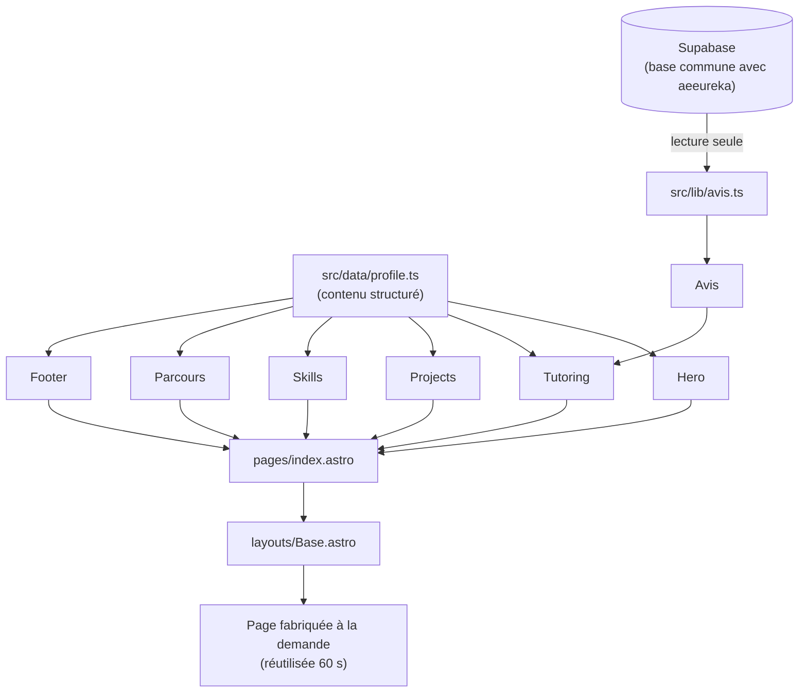
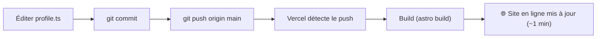

# Méthodologie & Workflow

Ce document explique **comment ce portfolio a été pensé et construit**, et **comment travailler au quotidien** dessus. Il sert de référence pour comprendre les choix techniques et le cycle de développement.

---

## 1. Objectif

Un **site portfolio personnel** : parcours académique et professionnel, projets et compétences. Objectifs de conception : un site **rapide, possédé, à faible maintenance**, et **déployé en continu**.

---

## 2. Méthodologie

Les principes qui ont guidé la conception :

1. **Décision avant construction.** Avant d'écrire du code, on a comparé les approches possibles : un outil **no-code** (type *Webflow*) versus du **code auto-hébergé** avec *Astro*. Critères décisifs : contrôle et possession du contenu, coût récurrent, performance, et le fait que le site lui-même serve de démonstration technique. → Choix du **code**.

2. **Design d'abord.** On a validé une **direction visuelle** (la section « hero ») avant de bâtir tout le site, pour ne pas construire sur une base incertaine.

3. **Le contenu est une donnée, pas du HTML.** Tout le contenu vit dans **un seul fichier typé** ([`src/data/profile.ts`](../src/data/profile.ts)). Les composants ne font que *l'afficher*. Modifier le site = éditer ce fichier, jamais le HTML.

4. **Itératif et vérifié.** On construit section par section, on vérifie le rendu au fur et à mesure, et on déploie tôt.

---

## 3. Stack technique

| Brique | Choix | Pourquoi |
|--------|-------|----------|
| Framework | **Astro** (statique, sauf la page d'accueil) | Rapide, léger, idéal pour un site de contenu |
| Langage | **TypeScript** | Contenu structuré et typé |
| Styles | **CSS** avec *design tokens* | Système de design cohérent, sans dépendance lourde |
| Polices | **@fontsource** (Space Grotesk + Inter) | **Auto-hébergées** — aucune requête vers un CDN externe |
| Données | **Supabase**, en lecture seule | Base commune avec aeeureka.com : les avis restent synchronisés |
| Versioning | **Git + GitHub** | Historique, sauvegarde |
| Hébergement | **Vercel** (+ `@astrojs/vercel`) | Build et mise en ligne automatiques à chaque push |

---

## 4. Architecture

```
src/
├── data/profile.ts        # ← LE contenu (source unique de vérité)
├── lib/avis.ts            # lecture des avis + libellés des cartes
├── styles/global.css      # système de design (tokens, composants)
├── layouts/Base.astro     # coquille HTML, polices, métadonnées SEO
├── components/             # sections de la page
│   ├── Nav.astro
│   ├── Hero.astro
│   ├── Tutoring.astro     # section « services » + les deux liens Eurêka
│   ├── Avis.astro         # les témoignages, lus dans la base
│   ├── Projects.astro
│   ├── Skills.astro
│   ├── Parcours.astro     # expérience + formation
│   └── Footer.astro
└── pages/index.astro      # assemble les sections
scripts/verifier-avis.mjs  # diagnostic de la lecture des avis
public/favicon.svg
docs/                      # cette documentation
```

**Flux du contenu** — deux sources, et une seule pour presque tout :


```mermaid
flowchart TD
    P["src/data/profile.ts<br/>(contenu structuré)"] --> C1[Hero]
    P --> C5[Tutoring]
    P --> C2[Projects]
    P --> C3[Skills]
    P --> C4[Parcours]
    P --> C6[Footer]
    DB[("Supabase<br/>(base commune avec aeeureka)")] -->|lecture seule| LIB["src/lib/avis.ts"]
    LIB --> AV[Avis]
    AV --> C5
    C1 --> PG[pages/index.astro]
    C5 --> PG
    C2 --> PG
    C3 --> PG
    C4 --> PG
    C6 --> PG
    PG --> L[layouts/Base.astro]
    L --> OUT["Page fabriquée à la demande<br/>(réutilisée 60 s)"]
```

**Conséquence pratique :** pour changer un texte, un projet, une compétence, on édite **uniquement `profile.ts`**. Les avis, eux, ne se modifient jamais ici — ils se corrigent dans l'espace admin d'aeeureka.

---

## 4 bis. Les avis, synchronisés avec aeeureka

### Le problème

Un site statique est fabriqué **une fois**, au déploiement. Des avis publiés ainsi seraient figés : approuver un avis sur aeeureka ne changerait rien au portfolio tant qu'on ne repousse pas du code. Ce n'est pas « synchronisé ».

### Les approches comparées

| Approche | Synchronisation | Ce que Google reçoit | Coût |
|---|---|---|---|
| Page fabriquée à chaque visite | À la seconde | La page complète | Une lecture de la base **par visiteur** |
| **Page fabriquée à la demande, gardée 60 s** | **≤ 1 minute** | **La page complète** | **Une lecture par minute** |
| Chargée par le navigateur du visiteur | À la seconde | Une page sans les avis | Aucune infrastructure |
| Reconstruction déclenchée | 1–2 minutes | La page complète | Dépend d'un signal côté aeeureka |

### Le choix, et pourquoi

**Page fabriquée à la demande, gardée 60 secondes** (`isr: { expiration: 60 }` dans `astro.config.mjs`). Une minute de décalage est invisible en pratique, et cette approche gagne même en oubliant le référencement :

- le visiteur voit les avis **immédiatement**, sans un trou blanc qui se remplit après coup ;
- **une seule lecture de la base par minute**, quel que soit le nombre de visiteurs ;
- ça marche même si le navigateur bloque les scripts.

Seule la page d'accueil est concernée (`export const prerender = false`). Toute autre page ajoutée plus tard restera statique par défaut.

### Les règles de lecture

Elles viennent de la base et sont documentées en détail dans [`src/lib/avis.ts`](../src/lib/avis.ts). Les trois à ne pas casser :

1. **Jamais `select('*')`.** Les droits sont accordés colonne par colonne : une requête qui demande tout échoue entièrement.
2. **Jamais de filtre sur `date_approbation`.** C'est la base qui décide ce qui est public. Un filtre écrit ici masquerait une règle de sécurité cassée au lieu de la révéler.
3. **Les libellés des cartes doivent rester identiques à ceux d'aeeureka.** Ils vivent au même endroit dans les deux dépôts (`LIEN_CARTE`, `src/lib/avis.ts`). Une divergence doit être un choix, jamais un oubli.

> ⚠️ Le portfolio n'utilise que la clé **anon**, publique par conception. La clé `service_role` ignore toute la sécurité de la base et n'a rien à faire dans ce dépôt.

---

## 5. Workflow de développement

### Prérequis
- [Node.js](https://nodejs.org) 20.6+ et npm.
- Un fichier `.env` à la racine, copié de `.env.example` et rempli (adresse Supabase + clé anon). Sans lui, le site tourne quand même : seule la section des avis reste vide.

### En local
```bash
npm install             # une seule fois
npm run dev             # serveur de dev → http://localhost:4321
npm run verifier-avis   # affiche ce que le site voit dans la base
```

### Modifier le contenu
Éditer [`src/data/profile.ts`](../src/data/profile.ts). Le serveur de dev recharge automatiquement.

### Publier
```bash
git add -A
git commit -m "Décris ton changement"
git push origin main
```

### Mise en ligne (automatique)
Vercel est connecté au dépôt GitHub : **chaque `push` sur `main` déclenche un build et une mise en ligne**, sans aucune action manuelle.


```mermaid
flowchart LR
    A["Éditer profile.ts"] --> B["git commit"]
    B --> C["git push origin main"]
    C --> D["Vercel détecte le push"]
    D --> E["Build (astro build)"]
    E --> F["🌐 Site en ligne mis à jour (~1 min)"]
```

---

## 6. Déploiement

- **Dépôt** : GitHub — [`github.com/landrykubwimana/portfolio`](https://github.com/landrykubwimana/portfolio)
- **Hébergeur** : Vercel, relié au dépôt (intégration continue).
- **Variables d'environnement** : `SUPABASE_URL` et `SUPABASE_ANON_KEY` doivent être posées dans Vercel → Settings → Environment Variables (Production, Preview et Development). Sans elles, le site se déploie mais la section des avis reste vide.
- **URL de production** : `https://landry-kubwimana-portfolio.vercel.app`
- **Domaine personnalisé** : optionnel, à brancher plus tard. Un domaine (ex. `landrykubwimana.com`) ne *remplace* pas l'hébergeur — il *pointe* vers lui. On peut l'ajouter à tout moment sans rien changer au site.

---

## 7. Améliorations possibles

- Ajouter les **liens de dépôts** sur les cartes de projets.
- Brancher un **domaine personnalisé**.
- Remettre un bouton **« Visiter le site de l'Académie »** le jour où la vitrine d'aeeureka.com sortira de son mur « site en préparation ». L'adresse est déjà dans `profile.ts` (`tutoring.url`), simplement pas utilisée.

---

## 8. Conventions

- **Contenu = données.** Pas de contenu en dur dans le HTML ; tout passe par `profile.ts`.
- **Commits descriptifs.** Un message clair par changement.
- **Rien de sensible dans Git.** Les secrets ne sont jamais versionnés.
- **Un dépôt à la fois.** Le portfolio et aeeureka.com sont deux projets séparés qui partagent une base de données, pas du code. Ce qui doit rester aligné entre les deux (libellés, ordre d'affichage) est signalé par un commentaire à l'endroit concerné.
